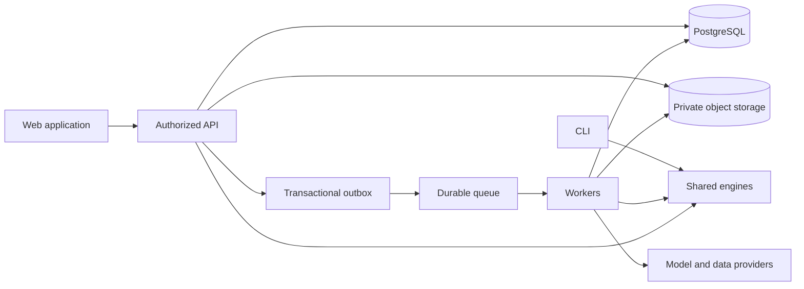

# Platform architecture

## 1. Current implementation

Maester is now a uv workspace with two installable Python packages. `apps/cli` is the Typer application; `packages/financial-engine` contains extraction, schema, arithmetic checks, local storage and Q&A. The engine keeps the `pdf_financial_qa` import namespace for compatibility. Both `maester` and `pdf-financial-qa` console commands are owned by `maester-cli`.

The root project coordinates dependencies and is not a distributable library. `uv.lock` resolves the workspace together. This follows uv's documented workspace model.[^1] The split makes application and reusable-library ownership explicit; it does not yet separate provider adapters from domain objects inside the engine.

`apps/web` contains a static SvelteKit index page with `/terminal` and `/login` entry points; its investor journeys are not built. `apps/api` and `apps/worker` contain boundary documentation only. None of them start a hosted server. There is no production database, queue, authentication service, market-data adapter or portfolio engine. The following sections specify their future implementation.

## 2. Target boundaries

```text
apps/
  web/                   SvelteKit / Svelte 5 / TypeScript investor UI (static index page implemented; journeys planned)
  api/                   Python HTTP API and authorization (planned)
  worker/                Python durable-job consumers (planned)
  cli/                   Local workflows and future operational commands
packages/
  financial-engine/      Existing document engine; evolve behind interfaces
  portfolio-engine/      Planned decimal ledger, valuations and returns
  contracts/             Planned generated TypeScript API client/schema artifacts
  ui/                    Planned shared Svelte components and tokens
  integrations/          Planned Python filing, price and broker adapters
infra/                   Add when deployment resources are implemented
docs/                    Product, semantics, architecture and operating decisions
tests/                   Cross-package regressions; domain tests grow with packages
scripts/                 Repository checks and generation entry points
```

Create future directories as real packages when there is implemented behavior to own. Explicit uv members prevent planning directories from breaking installation. `apps/web` is a standalone pnpm project with its own `pnpm-lock.yaml`; Node and pnpm are pinned in its `package.json` and `.nvmrc`. Add a root pnpm workspace file only when a second TypeScript package (`packages/ui` or `packages/contracts`) exists; do not add empty JavaScript packages just to make the tree appear complete. See [ADR 0002](decisions/0002-web-sveltekit-brutalist-design-system.md) and [DESIGN.md](DESIGN.md).

Use uv for Python and pnpm for TypeScript. Keep root Make commands as a small common entry point. Introduce a build-task orchestrator only when parallel builds and caching have measurable value. Language-specific lockfiles are intentional, not duplicate dependency authorities.

## 3. Application and dependency rules

| Boundary | Owns | Must not own |
| --- | --- | --- |
| Web | Rendering, interaction, client state, accessibility | Portfolio arithmetic, model credentials, private storage policy |
| API | Authentication, authorization, validation, orchestration, OpenAPI | Long-running extraction inside requests; duplicate ledger formulas |
| Worker | Job execution, retry, provider calls, progress, artifacts | User authorization derived from model output |
| Financial engine | Document processing, facts, validation and calculation interfaces | Imports from app entry points |
| Portfolio engine | Ledger rules, lots, cash flows, valuation/returns | HTTP handlers, browser formatting |
| Integrations | Provider-specific identifiers, payloads, rate limits and normalization | Selecting an investment or changing accounting without a domain operation |
| Contracts | Generated API types and transport client | A second hand-maintained definition of financial meaning |
| UI package | Evidence/table/money display components | Independent numerical truth or business permissions |

Applications depend on packages, and packages do not import applications. The existing CLI imports the engine. Python schemas are the authority for API contracts; generate TypeScript from the API's OpenAPI output. FastAPI supports the relevant OpenAPI and JSON Schema mechanisms.[^2] CI should reject uncommitted generated-client changes once generation exists.

Use a modular API plus separately deployable workers at first. Keep identity, research and portfolio domains in one database with clear ownership. Scale worker queues independently; split more services only when deployment cadence, load or operational ownership justifies it.

## 4. Target request and job flow



The existing CLI continues using local JSON by default. Hosted API/worker paths use repository/storage interfaces as they are introduced. A future remote CLI mode must be explicit; switching application scope must not silently upload a local cache.

Suggested hosted stack: SvelteKit web client (static today, adapter swap when server rendering is needed), FastAPI API, PostgreSQL, GCS private objects and Cloud Tasks for durable ingestion dispatch to worker handlers. This builds on the existing GCP dependency. Record a queue ADR before implementation if a different provider or multi-cloud requirement emerges. In-process HTTP background tasks are insufficient for durable extraction. No infrastructure is provisioned by this refactor.

## 5. Document pipeline

1. API checks workspace, quota and declared upload metadata; issues a narrowly scoped upload operation.
2. Source bytes are stored privately; size/type checks complete and a full SHA-256 is recorded.
3. API commits document and job records with an outbox entry; a dispatcher submits the job.
4. Worker verifies job scope, acquires a lease and creates an extraction revision.
5. Classify pages, extract text/tables/OCR as needed, then normalize into versioned facts with locations.
6. Run deterministic checks with explicit coverage and missing-component outcomes.
7. Store artifacts and issue records; atomically activate eligible facts for that revision.
8. Publish a completion/change event; UI retrieves status and the fact view.

Use idempotency keys based on workspace, document revision, pipeline version and operation. Assume at-least-once delivery. Retry transient failures with bounded backoff; route exhausted jobs to an inspectable failed state. Provider errors cannot mark a document Ready. Cancellation is cooperative and must check before activating results.

Extraction retry and publication must not duplicate facts, charges in usage accounting or change notifications. Usage records track attempts and successful outcomes separately. Store prompt/schema/model identifiers and artifact hashes without placing private text in normal logs.

The current single-call PDF path is an initial adapter. Large annual reports need measured page/section batching and context handling. A larger upload limit alone does not solve output truncation. Do not claim that the inherited `full_text` response covers every page without an independent coverage check.

## 6. Portfolio pipeline

Imports produce staging rows and a preview. Mapping resolves securities and transaction semantics. Domain validation replays candidate events against the account baseline and reports discrepancies. The final commit applies a versioned batch once. Domain events trigger recomputation of affected positions, daily valuations and return series.

A portfolio snapshot and an accounting ledger are separate input modes. Converting modes chooses a baseline and aligns existing positions, rather than appending historical transactions to snapshot totals. Recompute from the earliest affected date after an action/correction; mark dependent views stale until a consistent new calculation revision is ready.

Price ingestion records provider, observation/received times, adjustment basis and availability. The valuation job takes a stable data cutoff. Return responses carry method version, external-flow boundary, interval and coverage. The API and browser use the same results; neither calculates its own competing return percentage.

## 7. Retrieval and Analyst

Resolve user scope and authorization before retrieval. Quantitative questions select normalized facts and constrained calculation operations. Narrative questions select permitted text/excerpts with source locations. Use full-document context for small supported scopes when it fits and test it; introduce hierarchical or semantic retrieval for larger collections when evaluation demonstrates the need.

Initial retrieval should use company/document/period metadata and database search. A vector store is optional later; any semantic index needs workspace filtering and deletion propagation. Semantic similarity never overrides permissions or selects the accounting basis silently.

The model produces a typed query/calculation plan, not unrestricted SQL or executable code. Validate the plan, obtain domain results, then ask the model to explain only those results and references. Treat source instructions as untrusted document content. OWASP's guidance informs layered handling of indirect prompt injection.[^3]

Saved answers identify input revisions and an evidence cutoff. When inputs change, retain the original answer but show its outdated status and allow a new run. An answer cannot authorize a portfolio edit or external action.

## 8. Storage and ownership

PostgreSQL holds workspaces, companies, securities, portfolios, transactions, facts, jobs and review metadata. Store monetary amounts using numeric/decimal fields and serialized decimal strings at API boundaries.[^4] GCS holds originals, page renditions and immutable extraction/export artifacts. Short-lived caches may improve queries, but are not the ledger or source of truth.

Use workspace IDs in private records and composite relationships. API authorization is mandatory; database row policies provide additional isolation. The runtime DB role must not own protected tables or bypass row security; workers explicitly scope operations. PostgreSQL documents the relevant owner/superuser bypass behavior.[^5]

Object keys are opaque and downloads require access checks or short-lived signed URLs. Public securities/reference data and private user research have different ownership rules. A private upload must not become shared reference data through content deduplication. Licensed provider data must obey its own access/export entitlements.

## 9. Scale and operational envelope

Start with a pilot load: 100 active users, up to 100 holdings and 10,000 transactions per portfolio, and 20 simultaneous supported ingestion jobs. These are proposed test bounds, not verified capacity. API read load, extraction concurrency and model quotas have separate limits. Increase concurrency only after measuring cost and failure behavior.

Track request latency, queue age, extraction time by page count, failed-job rate, provider quota use, database query plans and per-workspace consumption. Autoscale workers from queue backlog within quota/budget caps; keep per-workspace fairness so one large upload batch does not starve others. Prefer pagination and read models over prematurely sharding PostgreSQL.

Backups and restore drills must include metadata-to-object consistency. Record RPO/RTO targets in the PRD, keep object versions where policy permits, and test deletion propagation to originals, derived facts, indexes, caches and exports. Retention requirements are product decisions before hosting, not properties implemented by a local `.gitignore`.

## 10. Delivery and migration

The completed R0 migration moves business files without changing extraction or cache schema. Original cache filenames and JSON remain readable. The CLI module moves to `maester_cli.cli`; programmatic callers must update that path, while engine imports remain stable. Existing `.env` and `data/cache` are preserved.

R1 introduces versioned hosted schemas with a separate migration tool for legacy caches. That tool must label absent page locations, timestamps and review status as unknown. Legacy numeric JSON may already have lost precision; retain raw input and do not represent conversion to Decimal as recovered source fidelity.

See [DEVELOPMENT.md](DEVELOPMENT.md) for working commands and [the monorepo ADR](decisions/0001-platform-monorepo.md) for consequences.

## Sources

[^1]: Astral, [Using workspaces](https://docs.astral.sh/uv/concepts/projects/workspaces/), accessed 9 September 2026.
[^2]: FastAPI, [Features](https://fastapi.tiangolo.com/features/), accessed 9 September 2026.
[^3]: OWASP, [LLM Prompt Injection Prevention Cheat Sheet](https://cheatsheetseries.owasp.org/cheatsheets/LLM_Prompt_Injection_Prevention_Cheat_Sheet.html), accessed 9 September 2026.
[^4]: PostgreSQL, [Numeric Types](https://www.postgresql.org/docs/18/datatype-numeric.html), accessed 9 September 2026.
[^5]: PostgreSQL, [Row Security Policies](https://www.postgresql.org/docs/18/ddl-rowsecurity.html), accessed 9 September 2026.
