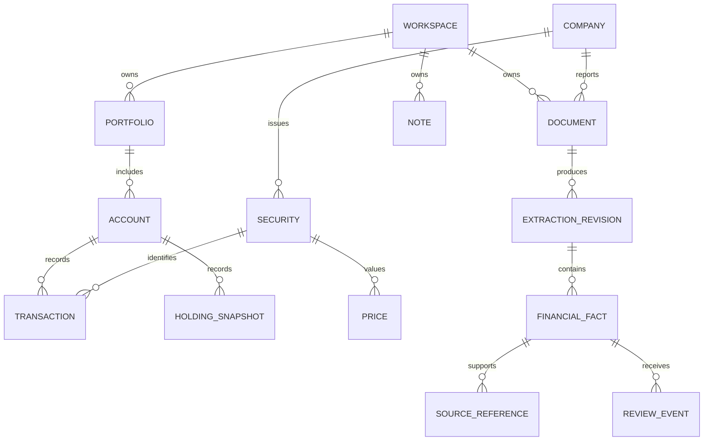

# Domain model and financial semantics

## 1. Scope and compatibility

This is the target hosted-domain specification. The current engine still uses `FinancialStatement`, `LineItem`, `PeriodValue` and `ExtractionResult`, with floating-point values and local JSON. Do not treat that schema as the portfolio ledger or assume it contains the entities below.

Use UUIDs or equivalent opaque IDs for records. Retain external identifiers separately. Monetary values, prices, quantities and normalized facts use decimal strings across JSON and Decimal/numeric arithmetic internally. Reject nonfinite values. Currency is an ISO currency code; exchange identity uses a stable market identifier rather than ticker alone.

## 2. Entity relationships



Company research exists independently of holdings. A security may be held in multiple accounts; a company may have multiple securities/listings. Private notes, source documents and answers remain workspace-owned even when company reference data is shared. The diagram omits join and membership tables for readability.

## 3. Record contracts

| Entity | Key fields | Invariants |
| --- | --- | --- |
| Workspace | ID, name, owner, locale, created_at | Every private object resolves to one workspace |
| Membership | workspace_id, user_id, role, state | R1 owner-only personal workspace; later sharing uses explicit roles |
| Company | ID, legal/display name, country, identifiers | Never keyed only by ticker; reference vs private records have explicit ownership |
| Security | ID, company_id, identifier/ISIN, exchange, ticker, currency, type, validity interval | Ticker reuse and dual listings do not merge distinct securities |
| Portfolio | ID, workspace_id, name, base_currency, benchmark_id, valuation_policy | Currency/boundary changes create recalculation context |
| Account | ID, portfolio_id, provider, currency policy, input_mode, baseline_date | Snapshot and ledger mode explicitly distinguished |
| HoldingSnapshot | account_id, security_id, date, quantity, optional cost/price, provenance | Does not imply historical transactions or returns |
| ImportBatch | ID, workspace/account, file_hash, format_version, state, mapping, receipt | Idempotent commit, exclusions and corrections retained |
| Transaction | ID, account/security, type, effective date/time, quantity, gross, fees, taxes, currency, source ID, batch/revision | Business event immutable after commit; corrections are linked revisions/reversals |
| CashEntry | account_id, transaction_id, amount, currency, effective date, flow_class | Every cash movement assigned exactly once; derived from committed events |
| Lot | account_id, security_id, opened date, quantity, remaining quantity, acquisition cost | Derived from supported transactions; cost-basis method versioned |
| CorporateAction | security, type, effective/ex/record/pay dates, ratio/amount, source, revision | Apply once; unsupported event makes affected history incomplete |
| Price | security, observed_at, price, currency, provider, received_at, adjustment_basis | Never substitute received time for quote time; stale policy explicit |
| FXRate | base/quote currency, date, rate, provider, convention | Conversion direction explicit; no latest FX substituted for historical return |
| Valuation | scope, date, value/cash, coverage, input revision, method | All dependent views use a consistent revision |
| ReturnSeries | scope, interval, method/version, values, benchmark basis, coverage | Undefined/incomplete is a state, not zero |
| Document | ID, workspace/company, content_hash, source/name, revision, storage_key, permissions | Full hash for new hosted files; originals immutable |
| ExtractionRevision | document_id, pipeline/schema/model version, state, page coverage, timings | Retry and reprocess do not overwrite earlier reviewed results |
| FinancialFact | concept, reported label/text/value/unit, normalized value, period, basis, dimensions, revision | Identity includes period, unit, consolidation and relevant dimensions |
| SourceReference | fact_id, document revision, page_index, printed label, table/section, excerpt, optional box | Location must resolve; absence never represented as verified citation |
| ReviewEvent | fact revision, actor, time, before/after, reason, outcome | Correction preserves original; optimistic concurrency |
| Calculation | method/version, inputs/revisions, parameters, result, availability | Reproducible from exact stored inputs |
| Note | workspace/company/portfolio, author, content, thesis/risks, references, review_at, revision | User assumptions distinct from reported facts |
| Conversation/Answer | workspace, scope, evidence cutoff, fact/calculation references, text, state | Does not widen authorization; old inputs can mark answer outdated |
| Alert | workspace/scope, condition, event identity, prior/current state, occurred/detected times | New transition creates notification; unchanged value does not |

## 4. Financial fact identity and presentation

Store `period_start` and `period_end` for duration facts; store `as_of_date` for instant balance-sheet facts. Keep the original fiscal label separately. A company fiscal year need not match calendar year. Consolidated/group and standalone/parent values are different series.

Preserve reported values and units before normalization. For example, reported `125.4` in INR millions maps to normalized `125400000`, not to a changed raw value. Retain a source sign convention, and parse parentheses as negative only in the relevant numeric context. A dash may indicate zero or not disclosed; map it from the source convention, not a global text rule.

Dimensions include segment, geography, share class and applicable accounting taxonomy. Select comparisons only across compatible definitions; ratios for banks and insurers can need different concepts from industrial companies. A generic EBITDA or free-cash-flow definition must state its method and not replace a company's reported label silently.

Restated facts include a filing/revision relationship and available-at timestamp. Default “latest reported” may select a newer restatement; point-in-time analysis uses only facts available by its cutoff. Store both effective financial period and known-at time. Do not build backtests from latest restatements and claim they were known historically.

Coverage, arithmetic result and human-review status are independent fields. A passed check means only that a specific check executed on known inputs and passed its tolerance. A missing component produces `not_checked` or `incomplete`, not a fabricated zero component.

## 5. Ledger event meaning

R2 supports deposits, withdrawals, buys, sells, cash dividends, explicit fees/taxes, reinvestments, splits, bonus issues and opening balances. Trades record trade date and settlement date when available; the initial valuation policy uses trade-date positions and includes unsettled cash obligations in the declared cash/economic-value treatment. Document the convention in every methodology view.

A buy reduces cash by gross consideration plus fees/taxes and increases quantity. A sell increases cash by net proceeds and reduces quantity. Reinvestment is a dividend and a buy linked together. A split changes quantities and per-unit basis without creating gain or external cash. Cash left in an account remains part of portfolio value.

Opening positions/cash establish the earliest calculable baseline. Transfers between accounts in the same portfolio are internal at portfolio level but can be external at account level. Transferred securities need value and acquisition-cost history; unsupported transfers must not be guessed. Negative positions are blocked for the initial long-only product unless a supported correction resolves them.

Use FIFO as the proposed display cost-basis method for the initial generic ledger, with costs allocated per the documented method. This is an analytical convention, not a jurisdiction-specific tax calculation. Do not label realized gain a tax liability. Add reviewed local tax rules only in F47.

### Synthetic accounting acceptance example

Start with a deposit of 2,000 currency units. Buy 10 shares at 100 with a fee of 2. Receive a cash dividend of 20. Sell 4 shares at 120 with a fee of 1. The remaining shares are quoted at 120, and there are no further external flows.

| Expected quantity/value | Result |
| --- | --- |
| Remaining quantity | 6 |
| Cash | 2,000 − 1,002 + 20 + 479 = 1,497 |
| Remaining market value | 720 |
| Portfolio value | 2,217 |
| Sold cost basis, fee capitalized and allocated | 400.80 |
| Realized gain | 479 − 400.80 = 78.20 |
| Remaining cost basis | 601.20 |
| Unrealized gain | 720 − 601.20 = 118.80 |
| Gain plus income | 78.20 + 118.80 + 20 = 217 |

This fixture is a proposed R2 test, not a calculation the current code performs. It must remain consistent across ledger, holdings, overview, export and Analyst results.

## 6. Return methodology contract

For a complete period, gain amount is ending portfolio value minus beginning portfolio value minus net external contributions. Income remaining in cash is already included in ending value and must not be added twice. Show a gain amount separately from a return rate.

Proposed daily TWR convention: beginning-of-day external inflows and end-of-day external outflows. Let `Vb` be beginning value, `Ve` ending value, `Cin` inflows and `Cout` outflows as positive magnitudes. The daily factor is `(Ve + Cout) / (Vb + Cin)`, and period TWR is the product of daily factors minus one. This convention is a documented approximation when intraday valuations are unavailable; disclose it. A zero denominator, missing valuation or unsupported action makes the relevant result unavailable. The external-flow distinction is informed by Portfolio Performance's method documentation.[^1]

XIRR uses investor-perspective cash flows: external contributions negative, external withdrawals positive, final portfolio value positive. A selected subperiod treats starting value as an initial negative flow. Solve `sum(CF_i / (1 + r)^((date_i - date_0)/365)) = 0` with `r > -1`, an explicit solver tolerance and actual dates. Label the result annualized even for a short interval. No solution or multiple plausible roots returns an explanatory status rather than an arbitrary rate. Cash-flow timing matters for this money-weighted measure.[^2]

Use total-return benchmarks when licensed and compatible. Price-only benchmarks remain clearly labeled. Both portfolio and benchmark require the same currency and supported interval. FX contribution and annualization are separate fields; an annualized rate is not a cumulative return. Never add account return percentages to derive a portfolio return.

Drawdown is calculated on the selected complete wealth/return index relative to its running maximum. Allocation uses a specified known-value or complete-value denominator and includes an unknown bucket where appropriate. A mixed-base-currency portfolio remains unsupported until F36 even if the UI can format several currencies.

## 7. API conventions and draft endpoints

These routes are proposed contracts, not running endpoints. Use `/v1`, opaque IDs, cursor pagination, ISO timestamps, decimal strings and explicit availability objects. Private responses never infer access from a path ID alone. Mutating imports and job creation accept an idempotency key; edits accept a revision/ETag to prevent lost updates.

| Endpoint | Response / behavior |
| --- | --- |
| `POST /v1/documents/uploads` | Authorized upload operation, limits and expiry |
| `POST /v1/documents/{id}/process` | `202` with durable job ID; idempotent |
| `GET /v1/jobs/{id}` | State, stage, measured progress, retryability |
| `GET /v1/companies/{id}/financials` | Basis, periods, units, facts, revisions and coverage |
| `GET /v1/facts/{id}/sources` | Authorized document references and locations |
| `POST /v1/facts/{id}/corrections` | New revision with reason; conflict on stale revision |
| `POST /v1/answers` | Explicit scope and calculation/evidence-backed response or durable operation |
| `POST /v1/portfolios` | Portfolio and declared currency/mode |
| `POST /v1/accounts/{id}/imports` | Staged import; does not commit transactions |
| `POST /v1/imports/{id}/commit` | Idempotent committed receipt or blocking issues |
| `GET /v1/portfolios/{id}/holdings` | Position rows, known-value subtotal and coverage |
| `GET /v1/portfolios/{id}/performance` | Method, interval, series, benchmark, input revision |
| `POST /v1/notes` | User-owned content and evidence references |

Example monetary field:

```json
{
  "amount": "2217.00",
  "currency": "INR",
  "as_of": "2026-03-31T10:00:00Z",
  "availability": "complete",
  "price_basis": "manual",
  "calculation_revision": "example-revision"
}
```

For missing amounts, return `amount: null` plus a reason and coverage; never `0` as a placeholder. Financial errors use a stable code, user-readable message, affected fields and a trace ID. Examples: `MISSING_PRICE_HISTORY`, `UNRESOLVED_SECURITY`, `INCOMPLETE_CASH_FLOWS`, `FACT_REVISION_CONFLICT`, `INSUFFICIENT_EVIDENCE`. Retryable infrastructure errors are distinct from user-correctable data issues.

## 8. Import and legacy migration rules

Deduplication uses workspace/account, provider source ID where available, normalized event identity and batch hash. Similar date/amount rows can be legitimate separate transactions; ambiguous duplicates require review rather than automatic deletion. Save mapping version and original row number so discrepancies can be traced.

An eventual legacy-cache importer accepts existing JSON without changing the originals. It assigns an explicit legacy schema version and preserves original numeric text where present. Unknown page location, processing timestamp, consolidation basis or coverage remain unknown. The current truncated 16-character cache key is retained for local compatibility; new hosted IDs use a full content hash plus independent document ownership.

## Sources

[^1]: Portfolio Performance, [Time-Weighted Rate of Return](https://help.portfolio-performance.info/en/concepts/performance/time-weighted/), accessed 9 September 2026. Maester's complete accounting and coverage policy above is a proposed product specification.
[^2]: Portfolio Performance, [Money weighted rate of return](https://help.portfolio-performance.info/en/concepts/performance/money-weighted/), accessed 9 September 2026.
